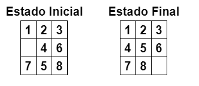
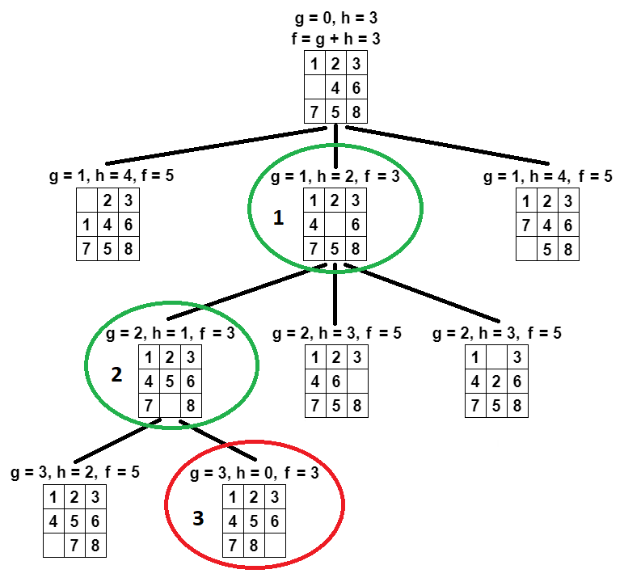

# Implementação do algoritmo A* - Jogo dos 8 números

O jogo dos 8 números consiste em um tabuleiro 3x3 (3 por 3) com 8 peças e um espaço vazio. O objetivo do quebra-cabeça é obter uma configuração determinada estado final, deslizando as peças a partir de uma configuração inicial, o estado inicial.

# Algoritmo A*

A* é um algoritmo de busca em grafos que pesquisa pelo melhor caminho de um dado, evitando expandir caminhos que já são
caros.

f(n) = g(n) + h(n)

* g(n) = custo de nó inicial até o nó n
* h(n) = custo estimado do caminho de n ao objetivo
* f(n) = custo total estimado do caminho de n até a meta.

# Função heurística - Hamming

A distância de Hamming, considera a quantidade de números fora da posição correta. 

* h1(n) = número de peças fora da posição

# Exemplo utilizado

# Solução Manual
